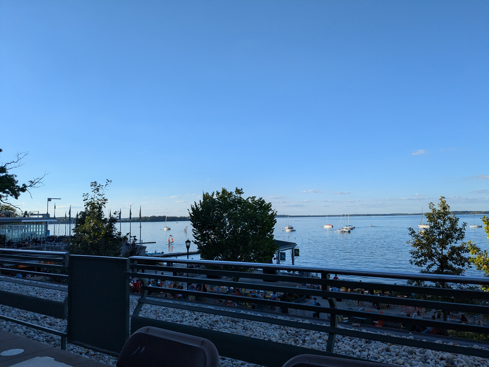
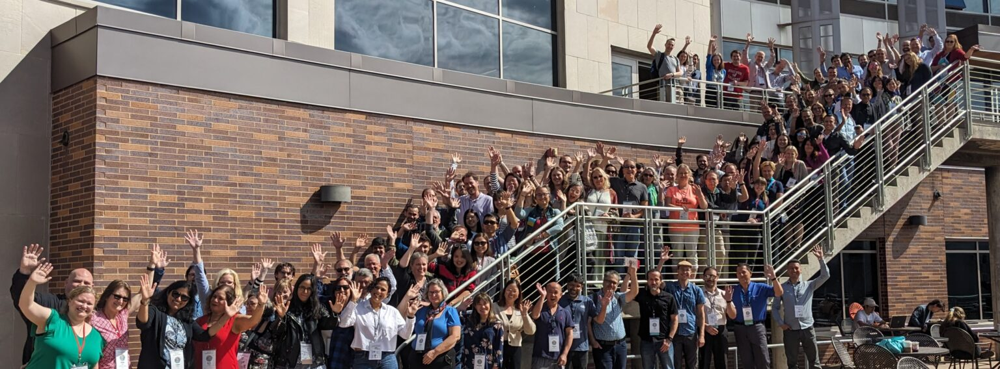
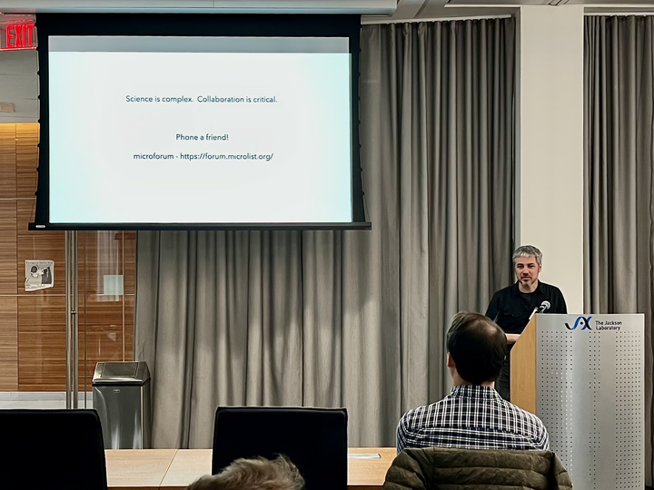

# So I went to a couple more conferences.

Before anything else, I have to thank [BINA](https://www.bioimagingnorthamerica.org/) for financial support getting me to their Community Congress AND for providing travel grants for folks coming to the NE Bioimage Analysis Meeting!

It's been a couple months, I know, I know, but I still want to recap the BINA Congress in September, and then I'm going to talk about a meeting we organized in our [JAX](https://www.jax.org) campus.

# BINA Community Congress 2024

So in September 23-26th a bunch of imaging folks from the US, Canada and Mexico (somehow we always end up talking about them in this order...) made their way to Madison, WI for the [BINA Community Congress 2024](https://www.bioimagingnorthamerica.org/events/bina-2024-community-congress/). 

## So what is this meeting?

It is a question I had going in. This was my first time attending a BINA meeting in person, and looking at the schedule beforehand it felt a bit... I don't want to sound negative because, as you will see, my feelings coming out of it were very positive, but navel-gaze-y? Most sessions seemed to be individual BINA working groups giving updates on what they have been doing, then a few keynotes, and that was most of the schedule.

I was very, very happy to be completely wrong about it. It became very clear quickly that yes, this is a pretty tight-knit community, but one that is open and welcoming. Each working group had full freedom to do whatever they wanted with the session allocated to it; a couple gave work updates, others gave the space for individual people to give talks, there were multiple panel discussions. It was much more varied and productive than I was expecting, and genuinely very good.

## What worked well?

Well, I just talked a bit about the schedule itself; I think giving working groups freedom to use their time as they saw fit was a big plus. Generally, I found the schedule extremely good: sessions were 1:30 at most, and we never had multiple sessions back-to-back. That kept people energized and meant there were plenty of breaks, which is both beneficial in terms of keeping an engaged audience and in making it clear that this was a conference structured around getting people talking to each other. That was emphasized by the long lunch breaks and breaks between the last session of the day and dinner. At this point, I think any in-person meeting should have such a focus; we can watch talks from home, but face time is scarce and should be maximized.

We had some excellent keynotes, such as Eric Betzig giving a talk honoring his late friend Mike Davidson and my good buddy Virginie Uhlmann from the [BioVisionCenter](https://www.biovisioncenter.uzh.ch/) in Zurich. We had my other good buddy [Beth Cimini](https://www.broadinstitute.org/bios/beth-cimini) accepting the inaugural [Mike Davidson Memorial Award](https://www.bioimagingnorthamerica.org/michael-w-davidson-memorial-award-2024/) (which she thoroughly deserves!). We had multiple dinners at the waterfront. Overall I had a fantastic time meeting old friends, reconnecting with folks I hadn't seen in a while, meeting folks I only knew from the Internet for the first time, and making completely new connections that are already paying off. 

Speaking of: this meeting used an online platform for its program and attendees list that included an online chat capability, and I found that extremely useful. First, knowing who would be there made me mentally establish a list of folks I should go talk to, and second because I had a couple of people reaching out to me via online chat before the conference asking for a chance to connect in person during the meeting, which made me go out of my way to find those people and engage with them. Highly recommend for other meetings!

## So what could be better?

Honestly? Not much. I think my one "room for improvement" note is that working groups felt like they were all doing their own thing despite obvious areas of overlap between them, where they could be working together. Whether that should be achieved by overlap in membership between groups or by having cross-group meetings and activities I am not sure, but I would love to see more of that! (spoilers: the nature of the 2025 meeting might force teams to have cross-group sessions, which is a good first step.)

## Final thoughts

If you are interested in what happened there, every single session was recorded and is available in this [youtube playlist](https://youtube.com/playlist?list=PLG5nZ7mF_r1pspbfoTObNRy1-9n1h15ZM&si=maQ-xt-fd6IuxViG). There's a lot of good stuff in there!

# Northeast Bioimage Analysis Meeting 2024

This one's way fresher in my mind (happened last week!) and way closer to my heart (I'm one of the organizers! It happens in our campus!). 

## So what is this meeting?

When I moved to the US five years ago, I felt very lonely. Professionally, I mean. Two years inside the rich bioimage analysis community in the UK (and in Europe more generally) spoiled me, and discovering there was no regular bioimage analysis meeting in the US, no support network, no structured community of practice, was a big blow. All of sudden it made sense that I kept running into people from the US at every bioimage analysis meeting in Europe...

Skip forward a couple years and a few folks at JAX plus the aforementioned Beth Cimini and the suddenly-based-in-the-US Simon Noerrelykke from the [Image Analysis Collaboratory](https://iac.hms.harvard.edu/) at Harvard Medical School decided enough is enough: if no one organizes a US-based bioimage analysis meeting, we might as well do it ourselves. So we did it: initially with a focus on the Northeast US and trying to establish a sense of local community in the area, we ran our first meeting in 2023. It was a single day, around 30-35 people showed up, it was great.

[This year we went bigger](https://www.jax.org/education-and-learning/education-calendar/2024/11-november/northeast-bioimage-analysis-meeting): a two-day meeting. Many invited speakers. Charging participation fees. And so we get to...

## What worked well?

I think we put together an outstanding list of speakers, both invited and abstract submissions. Given that we did not have a travel budget for invited speakers, a few of these talks were virtual, yes, but the average level of talks was extremely high, with many leading names in the area giving talks about their work. We got new people to attend the meeting, meet each other, have conversations with other folks working in similar positions elsewhere. 

And that was the main focus of this meeting: community and connections. We scheduled plenty of "downtime" to allow for conversations to blossom, and that was a success. I met many people I didn't know, and I was the one inviting speakers! I think it was a huge success both in terms of networking and in pure scientific terms. We even dragged, I mean, _gently invited_ folks for dinner at [Parkville Market](https://parkvillemarket.com/), which folks seemed to enjoy a lot.

## What could be better?

Well, this is a... small meeting. We had 20-25 people in person, plus a handful online. Which is about half of what I'd like this meeting to be. A bit of that was unfortunate scheduling (a large imaging meeting was scheduled for conflicting dates after we had already announced ours!), some of it is that we're still not reaching the people we'd like to reach, some of it is that we'd probably get more people if this meeting was in Boston. Still work to do. 

Organizing an event is exhausting. This year was mainly on my shoulders (with help from the Education team at JAX), and it was STRESSFUL. Organizing this every year at JAX is just not feasible without me losing years of my lifespan. So we need to think about what this looks like long-term.

## Final thoughts

This is a good meeting! I wish more people joined us! I think it would benefit everyone! I had a great time and seeing people interacting and having fruitful conversations is extremely rewarding as an organizer. I had a great time meeting new people, and seeing familiar faces. I think we are slowly creating a bit more of a sense of community in the area, and that's great.