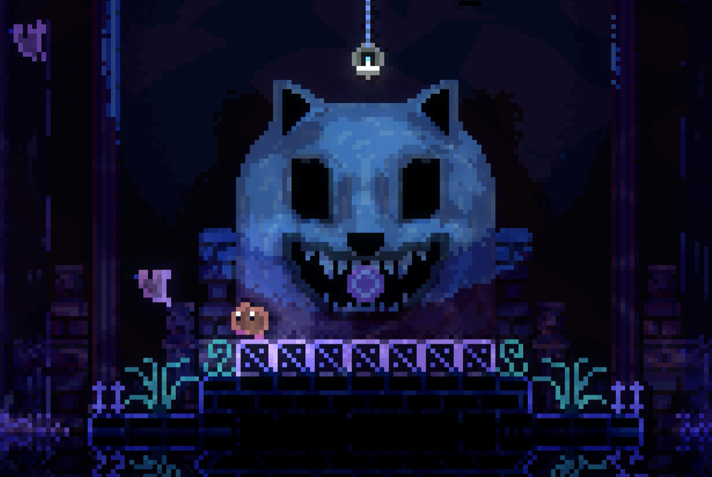
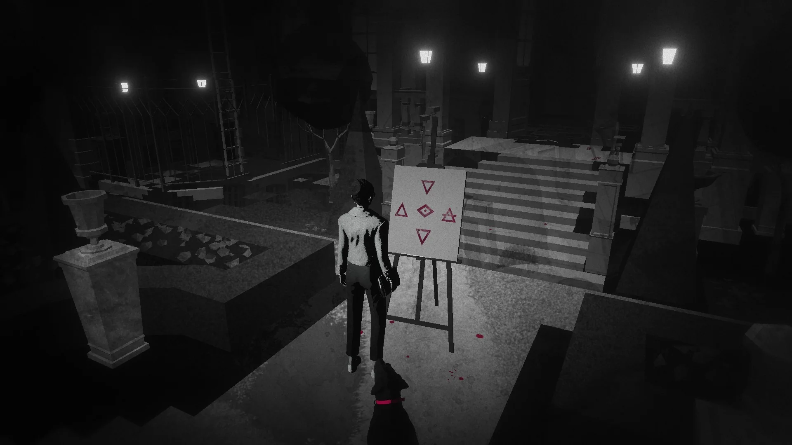
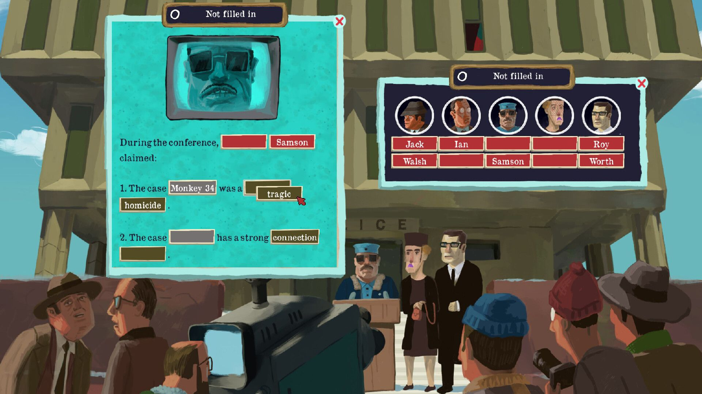
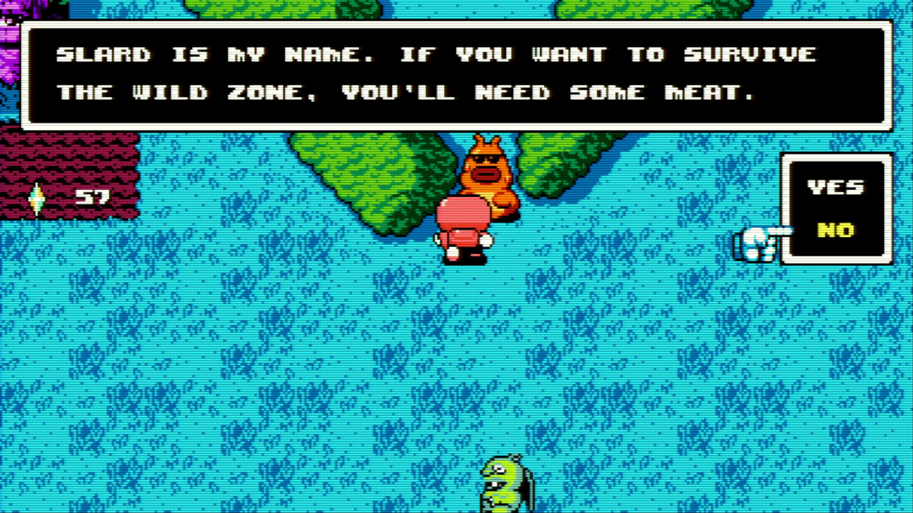

Cohost is dead, long live cohost. Last year I wrote a post [there](https://cohost.org/ratamero/post/3754778-in-which-i-talk-abou) talking about every game I played in 2023. If you are reading this in 2025, that link does not work anymore. So here we are, and now I have my own blog that I write on infrequently - so I might as well use it for writing about every game I've played in 2024.

# Games that came out in 2024

## Final Fantasy VII Rebirth

I think FFVII Remake, the game before this one, was the most pleasant surprise I've had with a game in a long, long time. It felt like an impossible project: remaking one of the most beloved games ever. They somehow pulled it off, making something that was simultaneously very close to the original and an interesting, original story, which opened up so many cool possibilities for whatever came next. 

What came next was this, pardon my french, wet fart. A bloated, confused mess of a game. A game where nothing happens for 100h, and then you get the most lukewarm, middle-of-the-road conclusion possible. They could have done literally anything with this game, and they chose to do nothing. The worst kind of checklist game. It's very rare that I get genuinely angry at a video game, but this one managed to do it. Multiple times.

## Animal Well

There was a little chunk of the year there where a bunch of cool, interesting, puzzle-adjacent games came out in short succession. Animal Well was one of them. It's a cute puzzle-platformer with incredible art, and then it's more, way more. I did not go all the way into the rabbit hole (a lil joke here for the people who played Animal Well), and stopped when I felt satisfied, and that took me about 15h. Not an easy game, but very, very interesting and worth playing.

## Balatro

Playing Balatro this year was mandatory. I did not play nearly as much as most people did, for sure; Probably less than 10h. It did not really have staying power for me, and the infinite-roguelike-keep-trying-until-you-get-a-good-run is very much not for me, and the way certain parts of the internet talk about it in terms of "addiction" rub me very much the wrong way (especially for a game with a lot of gambling-adjacent imagery). Still, it's undeniably a very cool idea extremely well executed, for better or worse. Definitely a game I preferred to admire from a distance.

## Lorelei and the Laser Eyes

This was completely out of left field for me. This studio pivoted from the very cool action-rhythm game Sayonara Wild Hearts to... a puzzle game? And a really good one? This game looks absolutely INCREDIBLE, has a genuinely interesting story that went places I did not expect (in a very, very positive way), and hit a difficulty level with its puzzles that was just right for me - a good mix of "you can solve this easily as soon as you find the relevant info" and "you might need some slightly lateral thinking to understand what's being asked". Maybe on the level of, say, a moderately difficult escape room; also, very much like an escape room, it is a game that gives you ALL the relevant info to solve its puzzles, even when there's a reasonable argument to be made that most people know about it (though I guess I am being unkind to folks who do not know Roman Numerals).

## Duck Detective: The Secret Salami

This is a cute, largely inoffensive little thing. It's very clearly inspired by The Case of the Golden Idol: you have little vignettes where you are presented with items and information, and then you need to fill in the blanks in some text (à la madlibs) explaining what has happened in that scene. It's pretty easy, pretty short, pretty funny. A decent couple-hours of fun, but not the most inspiring thing I've ever played.

## The Rise of the Golden Idol

This is the sequel to The Case of the Golden Idol, one of my favorite games of 2022. This is still a very similar formula to that game: you are presented with a scene (or a series of scenes) and you poke around at it until you figure out what has transpired, and then you fill in the blanks: the name of the people involved, some text describing the actions that took place, and sometimes more involved (and more creative) things that I do not want to give away. 

It is, by any aspect, a better game than the original, in my opinion, and also a more difficult one. It was extremely satisfying to slowly piece together what happens in every little bit of it, though! Chapter 4, in particular, is a delight, with two incredible puzzles (one of them is different from anything they had ever done and made me clap my hands in joy when I realized what was asked of me). It dragged on a _little_ too long for my taste (the last couple scenarios are a bit too much), but I had an incredible time with it.

## UFO 50

This has to be the best game of 2024, right? If I was to evaluate each of its 50 (!!!) constituent games on their own merits, a solid dozen would rank very highly in my game-of-the-year list. I went into it expecting to encounter small, largely arcade-y games, and maybe enjoy a handful of them (which I'd be more than happy with!). Instead, what I found were 50 _actual games_: yes, a few of them are fairly slight, many of them are pretty arcade-y. But after playing a little bit of every game, the list of games I wanted to go back to had... almost half of them.

Have I gone back to all of them? No, I haven't. Have I gone back to _most_ of them? Also no. But the idea that there are 20 great games there, just waiting for me to come back one day, is incredible. This game feels like a miracle; have you tried making 50 of _anything_? It's a lot! They made 50 _games_. And they sold the whole package for, like, $25. I've never felt so much like I was ripping off a developer. It's a wonderful thing, and I cannot recommend it enough.

# Older games that I played this year

## Boku no Natsuyasumi 2

I [wrote about that]() already. Go read it! It's a beautiful game.

## Yakuza 3, 4, 5, 6

Yes. all of these. Is Yakuza formulaic? Yes, very much so. Is the combat kinda whatever? Absolutely. But there's very few things in life I enjoy more than seeying Kazuma Kiryu and the goofballs he surrounds himself with doing some goofball stuff. These games wouldn't work without the weird tonal shifts from super-serious-crime-drama main story and outright comedy in the side stories. They wouldn't work if Kazuma Kiryu wasn't the most kind-hearted head-empty dude in the world (which is why a lot of 4 and 5 don't work super well for me). These games are a few slips away from being forgettable or actively disagreeable, and yet they manage to toe the line just right. I love them. (Yakuza 6 is the best of the bunch.)

## Live-a-Live

This shot up very high on my list of favorite JRPGs ever. Not everything hits (I find the meta/overarching narrative pretty meh, and some of the genre stuff it's doing is pretty rote), but it's so creative, so different from most other stuff in that space, so well-crafted. If you like JRPGs and you don't know much about Live-a-Live, I would just go and play it sight unseen. It's a good time.

## Contradiction: Spot the Liar

Ok, hear me out: murder mystery adventure game. FMV. Cheesy acting. Quaint English village that might be harboring a cult. Interested yet? What if I did... THIS



(go to 1:00 in the video if timestamp doesn't work)

Anyway, Contradiction is not a _good_ game, but it's a lot of fun, and I enjoyed it enough to put together a speedrun just because I could. 