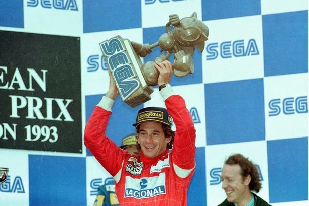

_Senna_, the Netflix series, is a huge deal in Brazil. It's Netflix dumping a truckload of money into a production that has Brazilian writers, Brazilian directors, Brazilian producers, (mostly) Brazilian actors. No TV series in Brazil has ever been this expensive. 

I really, really wanted to like this. And, in many ways, this is a success: it's a well-made, well-crafted miniseries produced for an international market. I bet it will attract a lot of eyeballs and be a commercial success (whatever that means for Netflix). I bet it will win some awards. But, about two episodes into this 6-parter, I had to start writing down my thoughts on this. The TL;DR: they spent 170 million dollars on a shiny piece of TV that has nothing interesting to say about its subject.

I'm not going to spend any time talking about Ayrton Senna and his story - if you are an F1 fan you know that by heart, if you are not, wikipedia is right here for you. The legend of Senna is as alive 30 years after his passing as it has ever been. His death, traumatic and untimely, froze the man and the driver in time: the Senna in people's minds today is the same as it was in 1994, if not even more sanctified.

Which is to say I understand this series being a hagiography. What else could you do, really? The mythologized sports story is a well-traveled road, the production involved Senna's family directly, a budget this big can't be put into anything but. And Senna's story fits the mold particularly well. 

Still: I will get on my soapbox real quick about Netflix's _Drive to Survive_ and its nefarious influence over sports documentaries. _Drive to Survive_ didn't do anything new: its particular brand of creating "safe drama" (i.e. superficial conflict without deep stakes), its insistence in framing its subjects as "good guys" regardless of reality, none of that is novel. Reality TV has been doing that for decades in very similar contexts. Storytelling is millenia old etc etc. I know. But it feels like the massive success of _Drive to Survive_ has somewhat warped the landscape of what people feel is possible in the sports documentary-ish space, in particular around F1, and I can't avoid seeing some of that here (at the risk of doing a [boss baby vibes](https://x.com/afraidofwasps/status/1177301482464526337)). Yes, Senna was a notoriously prickly person who had beef with a few characters. That is depicted in the series, but the stakes never feel real, never feel heavy; part of it seems to be a deliberate choice to never stew on the times Senna lost. Whole seasons of frustration and defeat are put into a "two years later" card so we can move on to the next success. We see Senna angry at times, but we never see him defeated. 

Even his biggest moments of elation feel somewhat weightless: say, for example, the 1991 Brazilian GP win. The stuff of legends. Genuinely one of the greatest F1 performances of all time. And some of that does come across in the series; but without the context, without knowing Senna had qualified first in Brazil the three years prior and had lost those races through bad luck, and crashes, and all sorts of weirdness, that incredible moment of finally winning his home grand prix under the weirdest possible circumstances feels emptied. It makes his "tinha que dar" comment afterwards, "it had to work this time", feel meaningless. It robs what is probably one of the greatest sporting moments of all time of its power.

And here's the thing: it still hits _for me_, because I have that context. It hits for me, as lots of things in this series do. If you are a Brazilian F1 fan of a certain generation, this is incredible nostalgia bait. They did a fantastic job recreating _everything_ to be period perfect, from the cars and the sponsors to, like, what the TV broadcast graphics looked like. The casting is genuinely incredible, with an great array of F1 driver lookalikes and the best Galvão Bueno Impersonator they could find. Kaya Scodelario's Portuguese is surprisingly very very good, even though I am not sure what her character is and why she's here. The races are very well shot, particularly when they don't go into CGI fuckery. The craft is all there. It's just they... decided to tell a story a lot of people already know, in a boring way. 

Then there's all the things they very pointedly decided _not_ to touch. Senna's relationship with a 15-year old. Senna's support for a shitty right-winger for the São Paulo Mayorship. It's a hagiography, I get it. Senna's family has a hand in the production. It's their choice not to talk about the Bad Stuff - but the Bad Stuff is part of who the man was, it's part of the story. It's more than just ignoring the bad stuff, though: there's a definite effort here to paint Senna as a Man Of The People, which is, in my opinion, laughable. He's never been that - he was born wealthy, grew up like that, has always been that. F1 has also never been what's been depicted in the series for us Brazilians. Yes, it was very popular at the time, in the sense that people would wake up early on Sundays to watch it, and Senna was one of the most famous people in the country, no question. But people were not decorating their streets and doing Senna Watch Parties. That's World Cup stuff in Brazil. It happens once every four years. Interlagos' stands didn't look like the Maracanã; even back then, F1 tickets were extremely expensive and only the (very small at the time) middle class could afford it. Senna was, by all accounts, a charitable man, yes, a Brazilian idol, for sure; but not a man of the people. Never was.

Funny enough, the best five minutes of the series are the last ones: when they show actual documental footage and actual pictures from all the moments the series covered, and you realize how far they went in trying to recreate things one-to-one (in particular, it made me remember the intro scene of episode 4, when Senna goes to Xuxa's children's show on TV, was 100% accurate in its absurdity). Many times during this, I caught myself thinking it would have been way cooler if they just inserted the original footage right then, during a particularly important moment. There's this specific shot of lap 6 in Imola 1994 that immediately made me shudder because I know it deep inside me to be the exact TV shot right before they cut to the camera that will capture the crash. And they recreated the specific camera angle, everything, to the degree that my body reacted to the recreation instictively. Why dump all that money into one-to-one recreations? Why not use the archival footage instead? I think it would have grounded the whole thing, brought it back to earth, and made it feel less like an exercise in craft, and more like the real story it was.