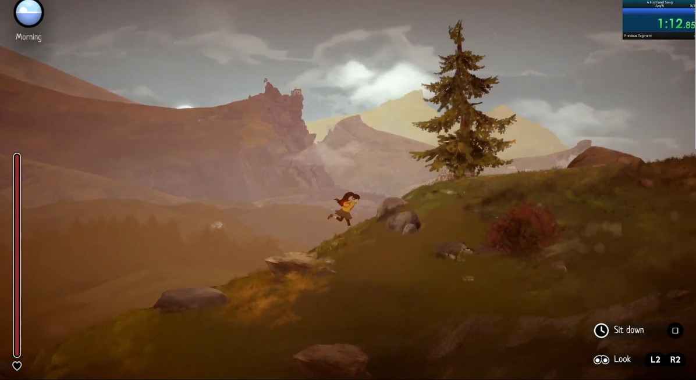
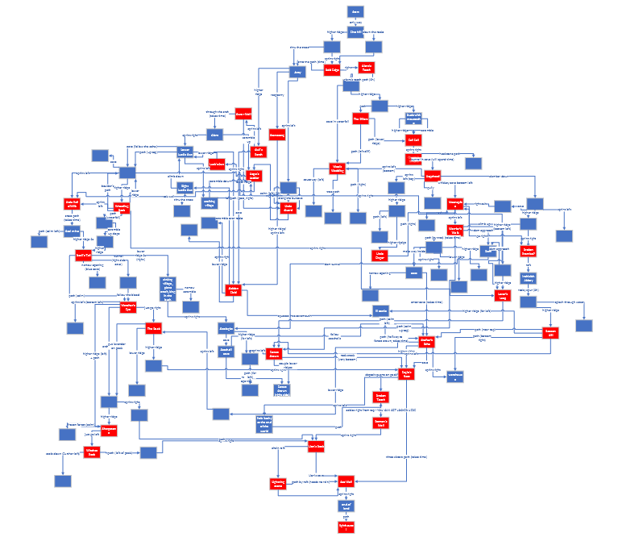
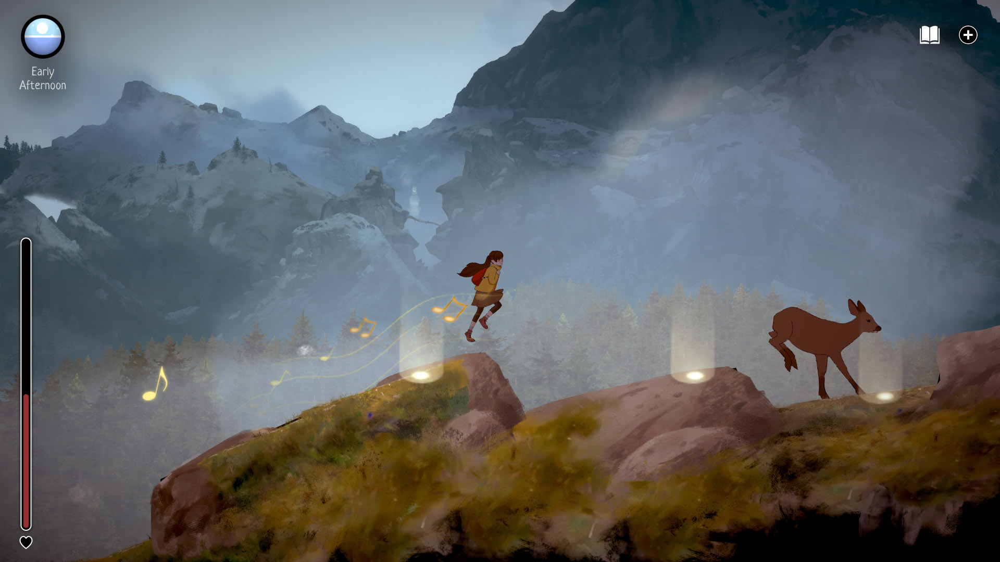

_A Highland Song_ is one of my favorite games of 2023. It's a beautiful, meditative, somewhat scary rendition of the Scottish Highlands as seen by Moira, a teen girl who runs away from home, decided to make it to the sea. It recreates that sensation most hikers have had, when you're surrounded by gorgeous nature somewhere you're not familiar with, and that pit in your stomach when you consider you have no idea how far from the closest human being (and from help, should something bad happen). I cannot recommend it enough.

It's also a _very_ nonlinear game meant to be replayed multiple times. You are given a soft time limit that you are unlikely to hit in your first playthrough, and essentially just dropped into the wilderness. You have a couple of maps from the areas surrounding your home that show you a few possible paths ahead, but as soon as you leave that immediate vicinity you're fully dependent on what you find on the way. Future playthroughs do keep your inventory, maps and shortcuts unlocked, so over time you become more familiar with the landscape, Moira accummulates knowledge about shortcuts and a collection of items that can help on the journey.

It immediately activated my speedrunning senses. In particular, the idea of fully mapping all possible paths between locations in excruciating detail, so that I could then find the quickest one, was very appealing. So I set out to do exactly that and put together a NG+ (i.e. "not your first playthrough") run. I unlocked every path. I correctly named every peak. I took lots and lots of notes. I made a flowchart.

And, sure enough, I got there. Two other people converged on the same route as I did, and right now there are 3 runs out there for the NG+ category, all with times between 8:05 and 8:13 (I'm the slowest). I had a lot of fun doing it, and eventually also put together a run for an "all peaks" category, where you must visit every one of the 36 peaks in the game and then finish it. It's also an interesting category because you cannot do it all in a single playthrough, so optimizing it was a cool challenge.

So the one thing remaining is the "any%" category - the "start game from scratch and finish as fast as possible". The main issue with any% is that, as I mentioned, you fully rely on the things you find on the way - and that includes finding maps for specific shortcuts. The current route for any% depends on finding two specific maps at two specific locations, and there's no way around it - if you don't find both by those specific points in the run, it's over. Restart the game and go again. Any backup strategy takes _minutes_ longer, and in a run that is less than 20 minutes long, that's not feasible.

This thing has been the bane of my existence for the last year or so. Whenever I'm practicing, I get both items fairly often - maybe a 50/50. As soon as I turn the timer on and start recording, the maps disappear. I kid you not, I have probably done about 15-20 recorded runs before I finally managed to get both items. It was so bad that, when I actually got the two maps while recording, I fully did not know what to do next. A true "dog that caught the car" thing.

I'm now resolute - I _will_ get better at this run. I will keep doing this enough times that the randomness evens out and I can actually get enough runs in. And, on the side, I am working on a new category ("no maps") where you are not allowed to pick up any maps _at all_: it will be slower, sure, but it will be way more consistent too. 